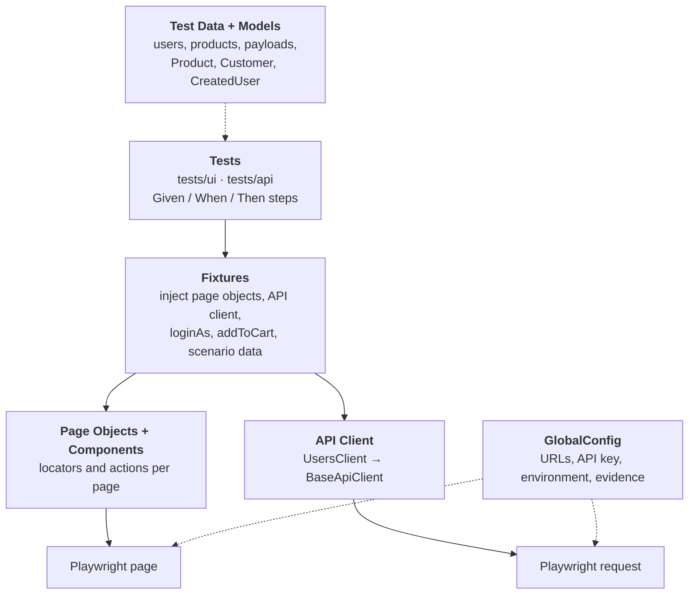

# Recruiterflow QA Assignment


UI and API test automation built with **Playwright + TypeScript**.

- **UI:** [saucedemo.com](https://www.saucedemo.com): login, cart, checkout and sorting
- **API:** [reqres.in](https://reqres.in): list users, create user, create-then-verify

## Getting started

**Prerequisite:** Node.js 20 or newer.

```bash
git clone https://github.com/mspworld/Recruiterflow.git
cd Recruiterflow
npm install
npx playwright test
```

`npm install` also downloads Chromium. No `.env` file is needed.

| Command | Description |
|---|---|
| `npx playwright test` | Run all tests (UI + API) |
| `npm run test:ui` | Run UI tests only |
| `npm run test:api` | Run API tests only |
| `npm run test:watch` | Run UI tests in a visible browser, one at a time, slowed down |
| `npm run test:evidence` | Run all tests with recording on and save the results to `evidence/` |
| `npm run report` | Open the HTML report of the last run |
| `npm run typecheck` | Check the TypeScript types |

## Framework architecture



| Layer | Responsibility |
|---|---|
| **Tests** | Describe the behaviour being checked, written as `Given / When / Then` steps. No locators or URLs. |
| **Fixtures** | Give each test ready-made page objects and the API client. `loginAs(user)` and `addToCart(names)` handle the repeated setup. |
| **Page Objects** | One class per page, holding its locators and actions. `BasePage` checks the URL. `SecurePage` adds the header and page-title check for pages behind login. |
| **Components** | Parts shared across pages: `Header` (cart badge and link) and `ProductList` (product rows used on the products, cart and overview pages). |
| **API Client** | `BaseApiClient` sends requests, parses JSON, retries network or 5xx errors, and attaches each request and response to the report. `UsersClient` has one method per endpoint. |
| **Test Data + Models** | Test data is kept out of the tests. Models are small classes with getters and setters, passed between steps through `ScenarioContext` (`set` / `get`). |
| **GlobalConfig** | The single place settings are read, with a default for every value. |

## Framework structure

```
Recruiterflow/
├── tests/
│   ├── ui/
│   │   ├── login.spec.ts           # scenarios 1, 2
│   │   ├── cart.spec.ts            # scenario 3
│   │   ├── checkout.spec.ts        # scenario 4
│   │   └── sorting.spec.ts         # scenario 5
│   └── api/
│       └── users.spec.ts           # scenarios 6, 7, 8
├── fixtures/
│   ├── ui.fixtures.ts              # page objects, loginAs, addToCart, uiContext
│   ├── api.fixtures.ts             # usersClient, apiContext
│   └── index.ts                    # merges UI + API fixtures into one `test`
├── pages/
│   ├── BasePage.ts                 # open(), expectLoaded() by URL
│   ├── SecurePage.ts               # header + page title for logged-in pages
│   ├── LoginPage.ts
│   ├── ProductsPage.ts
│   ├── CartPage.ts
│   ├── CheckoutInfoPage.ts
│   ├── CheckoutOverviewPage.ts
│   └── CheckoutCompletePage.ts
├── components/
│   ├── Header.ts                   # cart badge and cart link
│   └── ProductList.ts              # reads product names and prices
├── api/
│   ├── core/BaseApiClient.ts       # request, JSON parsing, retry, report attachment
│   ├── clients/UsersClient.ts      # listUsers(), createUser()
│   ├── endpoints.ts
│   ├── types/user.types.ts         # request and response types
│   └── assertions/userAssertions.ts
├── models/                         # Product, Customer, CreatedUser, UserCredentials
├── test-data/                      # users, products, messages, sort options, payloads
├── config/
│   ├── GlobalConfig.ts             # reads all settings
│   └── environments.ts             # URL and credential profile per environment
├── core/                           # BDD steps, ScenarioContext, retry, error wrapping
├── utils/price.ts
├── reporters/EvidenceReporter.ts   # builds the evidence/ folder in evidence mode
├── evidence/                       # recorded run: videos, step screenshots, traces, API calls
└── playwright.config.ts            # "ui" and "api" projects
```

## Test scenarios

| # | Scenario | Verified |
|---|---|---|
| 1 | Standard user logs in | URL is `/inventory.html` and the title is "Products" |
| 2 | Locked-out user | Exact error message shown **and** user stays on the login page |
| 3 | Add two products | Cart badge shows `2` |
| 4 | Full checkout | Order finishes with "Thank you for your order!" |
| 5 | Sort by price (low to high) | First product has the lowest listed price |
| 6 | `GET /api/users?page=2` | Status 200, `data` array, each user has `id`, `email`, `first_name`, `last_name` |
| 7 | `POST /api/users` | Status 201, name and job echoed back, `id` present, valid `createdAt` |
| 8 | Create-then-verify (bonus) | Created user saved in one step, verified against the payload in the next |

Also covered:
- the cart page lists the added products
- the checkout overview shows the correct item total
- the cart is empty after the order
- all four sort options produce a correctly ordered list

## Conventions

- **Locators:**
  - `getByTestId` for saucedemo's `data-test` attributes
  - `getByRole` for buttons
  - no CSS or XPath
- **Assertions:** Playwright's auto-waiting assertions, one behaviour per test. Expected values like the lowest price, item total and sort order are calculated from the page, not hard-coded.
- **Independence:** every test logs in and sets up its own data, so tests run in parallel and in any order.
- **Errors:** multi-step actions rethrow with the page and action name, for example `Could not add "Sauce Labs Backpack" to the cart on ProductsPage`.

## Reports and evidence

### HTML report

```bash
npx playwright test
npm run report
```

The report shows each `Given / When / Then` step, the API requests and responses, and the data each test used. On a normal run, a screenshot and trace are saved only for failed tests.

### Recorded evidence

```bash
npm run test:evidence
```

This runs all tests with recording on and saves the results to `evidence/`, one folder per test:

| Test type | Saved per test |
|---|---|
| UI | `video.webm`, `preview.gif`, a screenshot after each step (`01-given-....png`, `02-when-....png`, ...), `trace.zip` |
| API | the request and response of each call (`.json`) |

[`evidence/README.md`](evidence/README.md) lists every test with its result, steps and files. The `evidence/` folder in this repo is from the last recorded run (15 of 15 passed).

To open a trace:

```bash
npx playwright show-trace evidence/ui/<test-folder>/trace.zip
```

`preview.gif` is created only if `ffmpeg` is installed. Everything else needs no extra setup.

## Configuration

Everything is optional. Use environment variables, or copy `.env.example` to `.env`.

| Variable | Default |
|---|---|
| `TEST_ENV` | `production` |
| `UI_BASE_URL` | `https://www.saucedemo.com` |
| `API_BASE_URL` | `https://reqres.in` |
| `REQRES_API_KEY` | `reqres-free-v1` |
| `SAUCE_PASSWORD` | `secret_sauce` |
| `EVIDENCE` | `failure` (`off` / `failure` / `full`) |
| `HEADED` / `SLOW_MO` | `false` / `0` |
| `API_RETRIES` | `2` |

> **Note on reqres.in limits:**
> - reqres allows **40 requests per day per IP address** (reset at midnight UTC) and **20 requests per minute**.
> - One full run of this suite makes 3 API requests.
> - If the daily limit is reached, reqres returns `429` and the API tests fail straight away with reqres's message, which includes when the limit resets.
> - reqres's message says a free account gives a higher limit and a personal API key. The suite sends the value of `REQRES_API_KEY` as the `x-api-key` header.
