# Test evidence

Recorded with `npm run test:evidence` on 2026-09-28 07:56 UTC.

**Result:** 15 of 15 tests passed (run status: `passed`).

- **UI tests:** preview GIF, full video, a screenshot after every step, and a trace that replays every click and keystroke. Open `trace.zip` at [trace.playwright.dev](https://trace.playwright.dev) or with `npx playwright show-trace <file>`.
- **API tests:** the steps, plus the full request and response of every call.

## UI tests

### ✅ Cart › adding two products updates the cart badge to 2

`2.9s` · [Video](ui/cart-adding-two-products-updates-the-cart-badge-to-2-ff1af0/video.webm) · [Trace](ui/cart-adding-two-products-updates-the-cart-badge-to-2-ff1af0/trace.zip)


| # | Step | Screenshot after the step |
|---|---|---|
| 1 | Given I am logged in as the standard user |  |
| 2 | When I add two products to the cart |  |
| 3 | Then the cart badge shows 2 |  |

### ✅ Cart › the cart page lists the products that were added

`3.0s` · [Video](ui/cart-the-cart-page-lists-the-products-that-were-added-0b2968/video.webm) · [Trace](ui/cart-the-cart-page-lists-the-products-that-were-added-0b2968/trace.zip)


| # | Step | Screenshot after the step |
|---|---|---|
| 1 | Given I am logged in as the standard user | 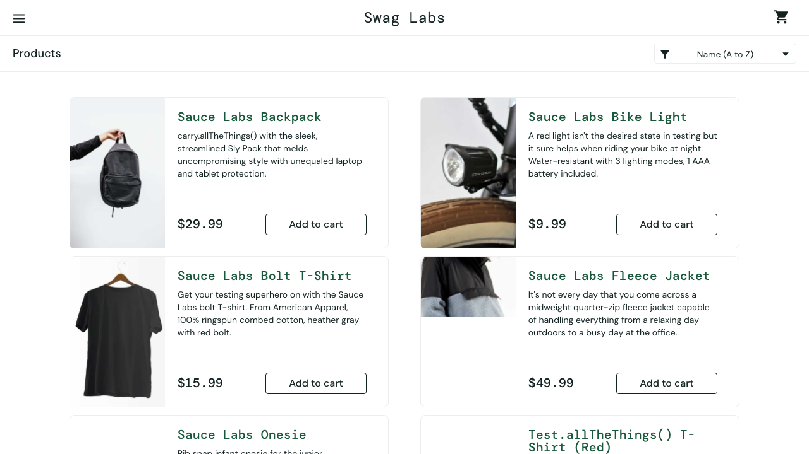 |
| 2 | And I have added two products to the cart | 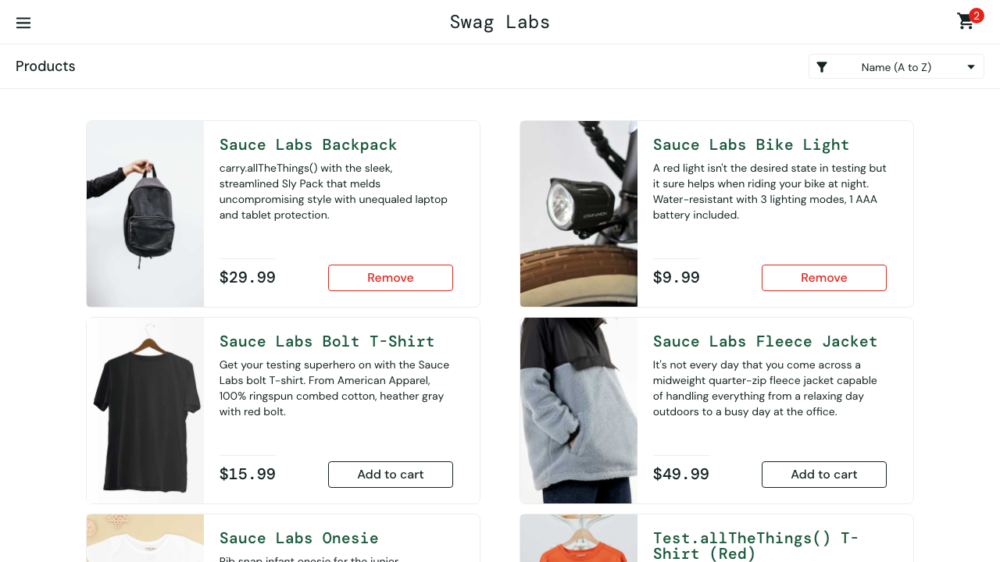 |
| 3 | When I open the cart | 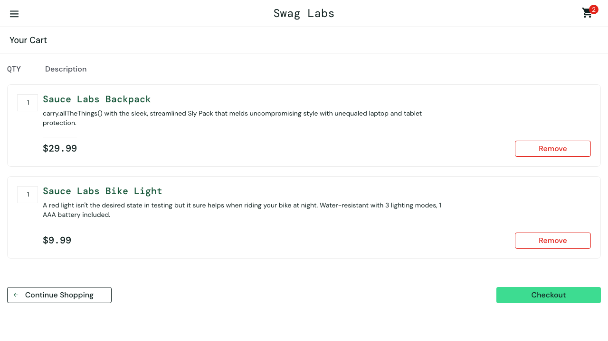 |
| 4 | Then the cart lists exactly those products |  |

### ✅ Checkout › the overview shows the selected products and the correct item total

`3.4s` · [Video](ui/checkout-the-overview-shows-the-selected-products-and-the-co-49e15f/video.webm) · [Trace](ui/checkout-the-overview-shows-the-selected-products-and-the-co-49e15f/trace.zip)


| # | Step | Screenshot after the step |
|---|---|---|
| 1 | Given I am logged in as the standard user | 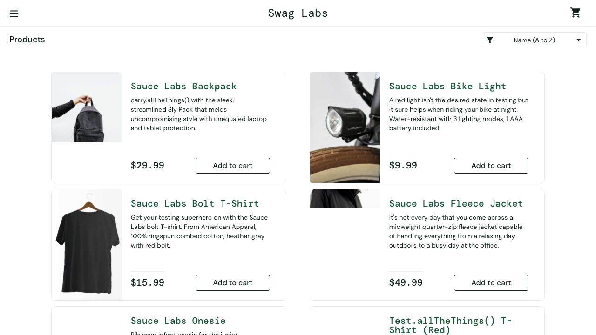 |
| 2 | And I have two products in my cart |  |
| 3 | And I have entered my checkout information |  |
| 4 | Then the overview lists the selected products |  |
| 5 | And the item total is the sum of their prices | 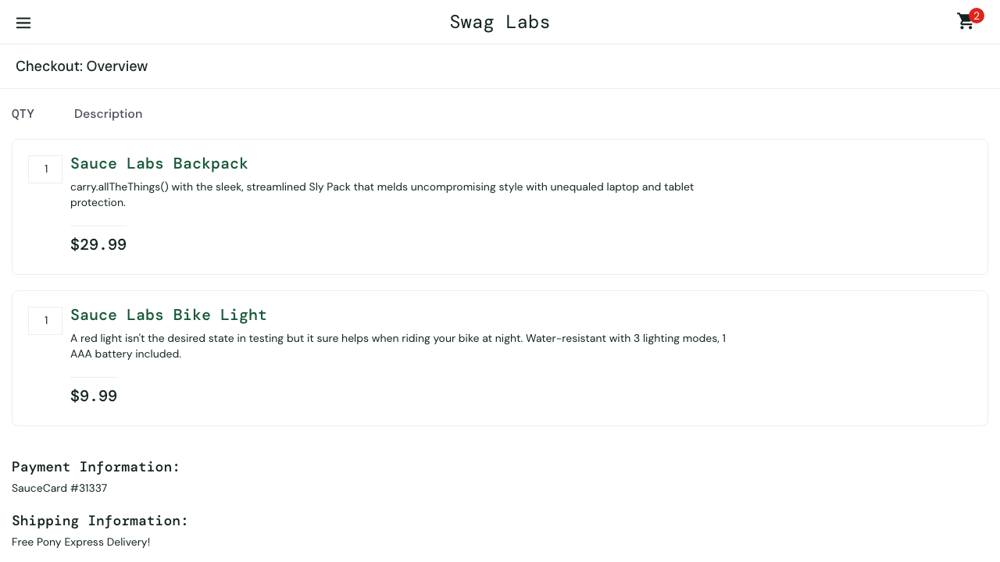 |

### ✅ Checkout › finishing the order shows the "Thank you for your order!" message

`3.2s` · [Video](ui/checkout-finishing-the-order-shows-the-thank-you-for-your-or-9aa64f/video.webm) · [Trace](ui/checkout-finishing-the-order-shows-the-thank-you-for-your-or-9aa64f/trace.zip)


| # | Step | Screenshot after the step |
|---|---|---|
| 1 | Given I am logged in as the standard user | 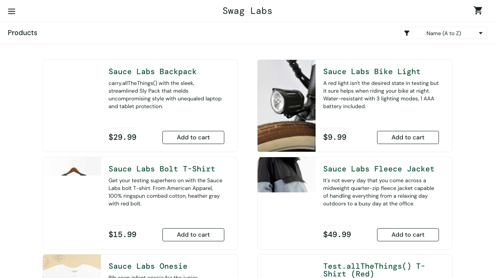 |
| 2 | And I have two products in my cart |  |
| 3 | And I have entered my checkout information |  |
| 4 | When I finish the order | 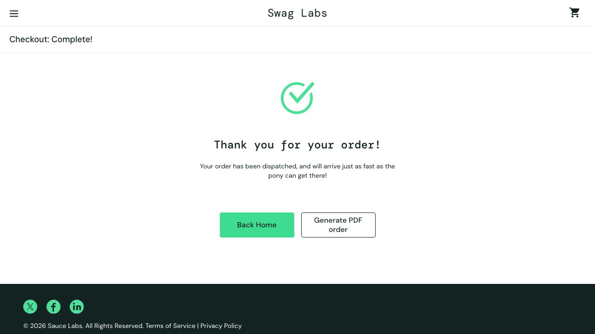 |
| 5 | Then I see the thank-you message |  |

### ✅ Checkout › the cart is empty after the order is placed

`2.5s` · [Video](ui/checkout-the-cart-is-empty-after-the-order-is-placed-6092ad/video.webm) · [Trace](ui/checkout-the-cart-is-empty-after-the-order-is-placed-6092ad/trace.zip)


| # | Step | Screenshot after the step |
|---|---|---|
| 1 | Given I am logged in as the standard user |  |
| 2 | And I have two products in my cart |  |
| 3 | And I have entered my checkout information |  |
| 4 | When I finish the order | 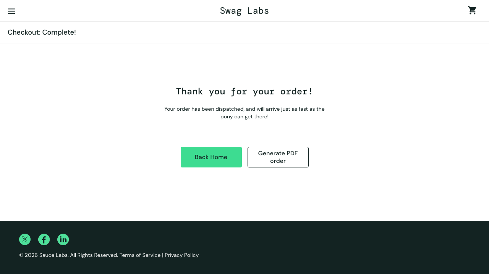 |
| 5 | Then the cart badge is gone |  |

### ✅ Login › standard user logs in and lands on the products page

`1.8s` · [Video](ui/login-standard-user-logs-in-and-lands-on-the-products-page-2561c6/video.webm) · [Trace](ui/login-standard-user-logs-in-and-lands-on-the-products-page-2561c6/trace.zip)

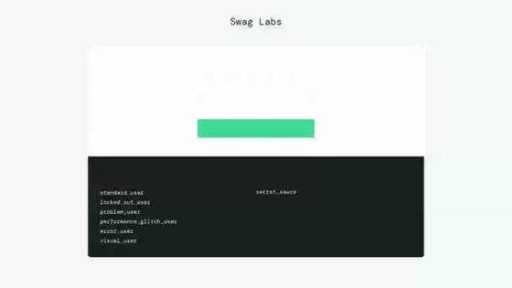

| # | Step | Screenshot after the step |
|---|---|---|
| 1 | Given I am on the login page | 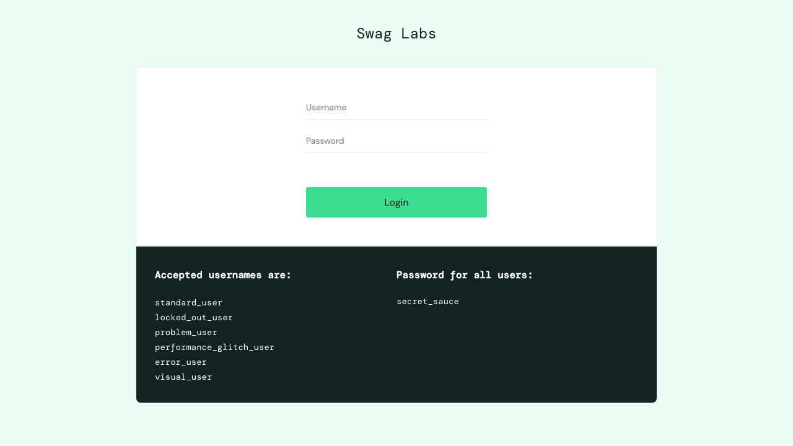 |
| 2 | When I log in as the standard user |  |
| 3 | Then I land on the products page | 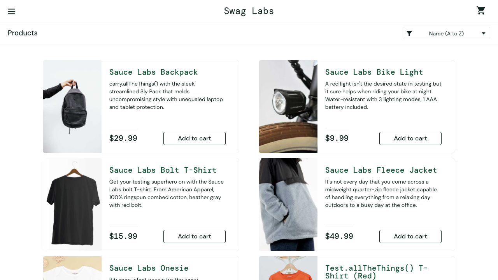 |

### ✅ Login › locked-out user sees an error and is not logged in

`1.4s` · [Video](ui/login-locked-out-user-sees-an-error-and-is-not-logged-in-7667f6/video.webm) · [Trace](ui/login-locked-out-user-sees-an-error-and-is-not-logged-in-7667f6/trace.zip)


| # | Step | Screenshot after the step |
|---|---|---|
| 1 | Given I am on the login page |  |
| 2 | When I log in as the locked-out user | 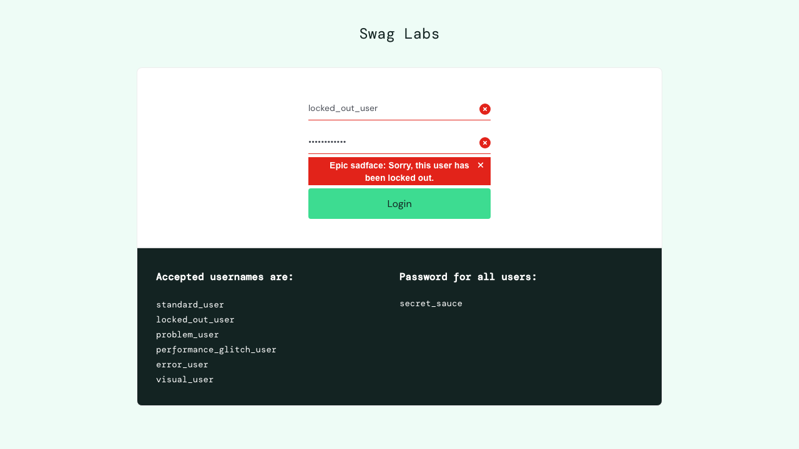 |
| 3 | Then I see the locked-out error message |  |
| 4 | And I am still on the login page |  |

### ✅ Product sorting › sorting by price (low to high) shows the cheapest product first

`1.6s` · [Video](ui/product-sorting-sorting-by-price-low-to-high-shows-the-cheap-c4f2d5/video.webm) · [Trace](ui/product-sorting-sorting-by-price-low-to-high-shows-the-cheap-c4f2d5/trace.zip)


| # | Step | Screenshot after the step |
|---|---|---|
| 1 | Given I am logged in as the standard user |  |
| 2 | When I sort by price, low to high |  |
| 3 | Then the first product has the lowest price |  |

### ✅ Product sorting › every product is in order when sorted by "Name (A to Z)"

`1.9s` · [Video](ui/product-sorting-every-product-is-in-order-when-sorted-by-nam-6d5ddc/video.webm) · [Trace](ui/product-sorting-every-product-is-in-order-when-sorted-by-nam-6d5ddc/trace.zip)


| # | Step | Screenshot after the step |
|---|---|---|
| 1 | Given I am logged in as the standard user |  |
| 2 | When I sort by "Name (A to Z)" |  |
| 3 | Then the whole list is in the expected order |  |

### ✅ Product sorting › every product is in order when sorted by "Name (Z to A)"

`1.8s` · [Video](ui/product-sorting-every-product-is-in-order-when-sorted-by-nam-30af1e/video.webm) · [Trace](ui/product-sorting-every-product-is-in-order-when-sorted-by-nam-30af1e/trace.zip)


| # | Step | Screenshot after the step |
|---|---|---|
| 1 | Given I am logged in as the standard user |  |
| 2 | When I sort by "Name (Z to A)" | 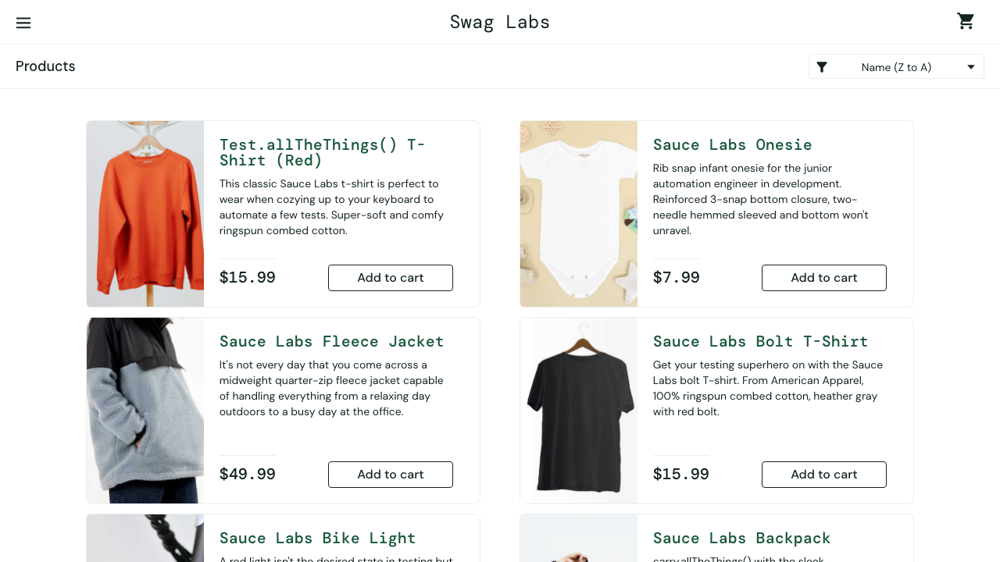 |
| 3 | Then the whole list is in the expected order |  |

### ✅ Product sorting › every product is in order when sorted by "Price (low to high)"

`1.6s` · [Video](ui/product-sorting-every-product-is-in-order-when-sorted-by-pri-c50683/video.webm) · [Trace](ui/product-sorting-every-product-is-in-order-when-sorted-by-pri-c50683/trace.zip)


| # | Step | Screenshot after the step |
|---|---|---|
| 1 | Given I am logged in as the standard user |  |
| 2 | When I sort by "Price (low to high)" | 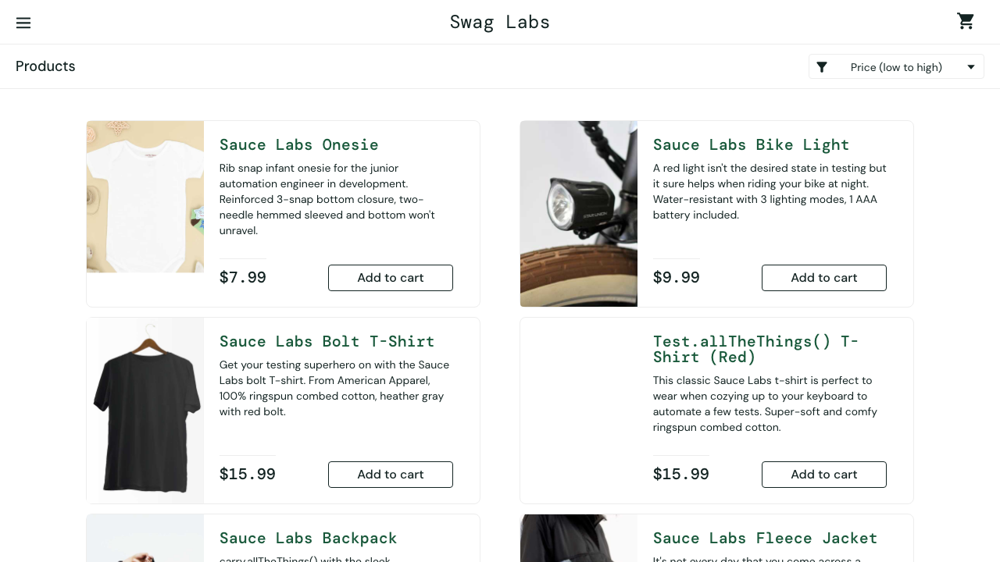 |
| 3 | Then the whole list is in the expected order | 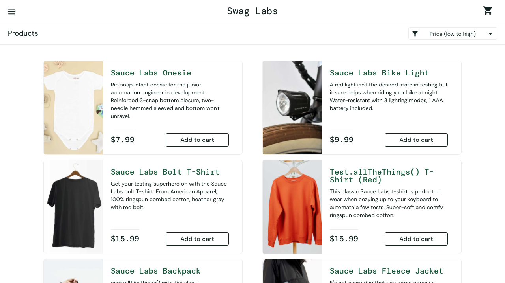 |

### ✅ Product sorting › every product is in order when sorted by "Price (high to low)"

`1.4s` · [Video](ui/product-sorting-every-product-is-in-order-when-sorted-by-pri-98ab72/video.webm) · [Trace](ui/product-sorting-every-product-is-in-order-when-sorted-by-pri-98ab72/trace.zip)


| # | Step | Screenshot after the step |
|---|---|---|
| 1 | Given I am logged in as the standard user | 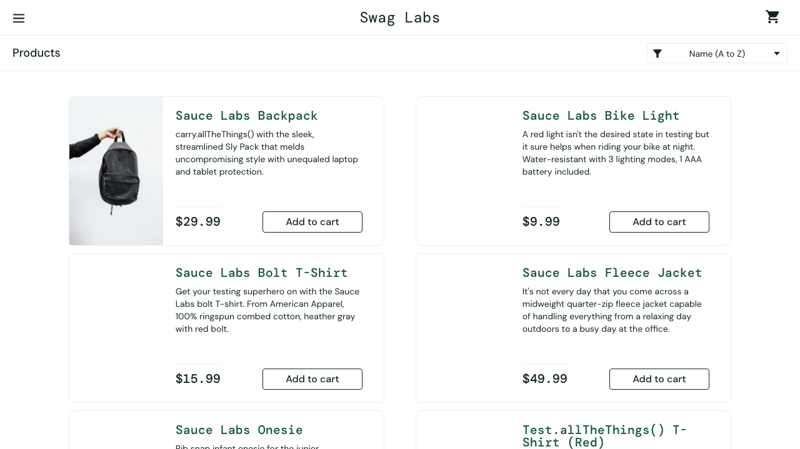 |
| 2 | When I sort by "Price (high to low)" | 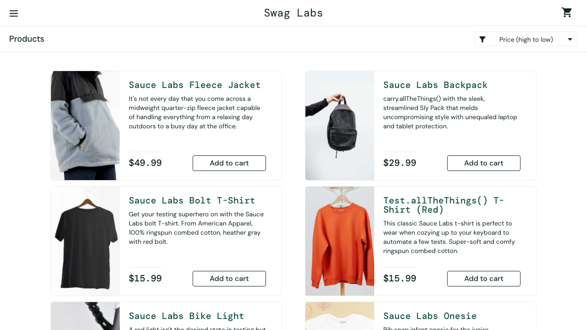 |
| 3 | Then the whole list is in the expected order |  |

## API tests

### ✅ Users API › GET /api/users?page=2 returns a list of users with the required fields

`0.3s`

1. When I request page 2 of users
2. Then the status is 200
3. And the response has a "data" array
4. And every user has id, email, first_name and last_name

<details><summary><code>GET /api/users</code> → 200</summary>

```json
{
  "request": {
    "method": "GET",
    "path": "/api/users",
    "params": {
      "page": 2
    }
  },
  "response": {
    "status": 200,
    "body": {
      "page": 2,
      "per_page": 6,
      "total": 12,
      "total_pages": 2,
      "data": [
        {
          "id": 7,
          "email": "michael.lawson@reqres.in",
          "first_name": "Michael",
          "last_name": "Lawson",
          "avatar": "https://reqres.in/img/faces/7-image.jpg"
        },
        {
          "id": 8,
          "email": "lindsay.ferguson@reqres.in",
          "first_name": "Lindsay",
          "last_name": "Ferguson",
          "avatar": "https://reqres.in/img/faces/8-image.jpg"
        },
        {
          "id": 9,
          "email": "tobias.funke@reqres.in",
          "first_name": "Tobias",
          "last_name": "Funke",
          "avatar": "https://reqres.in/img/faces/9-image.jpg"
        },
        {
          "id": 10,
          "email": "byron.fields@reqres.in",
          "first_name": "Byron",
          "last_name": "Fields",
          "avatar": "https://reqres.in/img/faces/10-image.jpg"
        },
        {
          "id": 11,
          "email": "george.edwards@reqres.in",
          "first_name": "George",
          "last_name": "Edwards",
          "avatar": "https://reqres.in/img/faces/11-image.jpg"
        },
        {
          "id": 12,
          "email": "rachel.howell@reqres.in",
          "first_name": "Rachel",
          "last_name": "Howell",
          "avatar": "https://reqres.in/img/faces/12-image.jpg"
        }
      ],
      "support": {
        "url": "https://benhowdle.im/first-cto-playbook?utm_source=reqres&utm_medium=json&utm_campaign=referral",
        "text": "Become a better CTO. A playbook of painful stories and practical advice from a two-time startup CTO."
      },
      "_meta": {
        "powered_by": "ReqRes",
        "docs_url": "https://app.reqres.in/documentation",
        "upgrade_url": "https://app.reqres.in/upgrade",
        "example_url": "https://app.reqres.in/examples/notes-app",
        "variant": "v1_a",
        "message": "Your data persists here. Add auth, logs, and custom schemas to build a real backend.",
        "cta": {
          "label": "See example app",
          "url": "https://app.reqres.in/examples/notes-app"
        },
        "context": "legacy_success"
      }
    }
  }
}
```

</details>

### ✅ Users API › POST /api/users creates a user and echoes back name and job

`0.3s`

1. When I create the user "morpheus"
2. Then the status is 201
3. And the response has the same name and job, plus an id and createdAt

<details><summary><code>POST /api/users</code> → 201</summary>

```json
{
  "request": {
    "method": "POST",
    "path": "/api/users",
    "data": {
      "name": "morpheus",
      "job": "leader"
    }
  },
  "response": {
    "status": 201,
    "body": {
      "name": "morpheus",
      "job": "leader",
      "id": "744",
      "createdAt": "2026-09-28T07:56:23.157Z",
      "_meta": {
        "powered_by": "ReqRes",
        "docs_url": "https://app.reqres.in/documentation",
        "upgrade_url": "https://app.reqres.in/upgrade",
        "example_url": "https://app.reqres.in/examples/notes-app",
        "variant": "v1_a",
        "message": "Your data persists here. Add auth, logs, and custom schemas to build a real backend.",
        "cta": {
          "label": "See example app",
          "url": "https://app.reqres.in/examples/notes-app"
        },
        "context": "legacy_success"
      }
    }
  }
}
```

</details>

### ✅ Users API › create-then-verify: the created user is saved and checked in the next step

`0.3s`

1. Given I have a new user to create
2. When I create the user and save the result
3. Then the saved user matches what I sent

<details><summary><code>POST /api/users</code> → 201</summary>

```json
{
  "request": {
    "method": "POST",
    "path": "/api/users",
    "data": {
      "name": "qa-user-1790582182972",
      "job": "developer"
    }
  },
  "response": {
    "status": 201,
    "body": {
      "name": "qa-user-1790582182972",
      "job": "developer",
      "id": "204",
      "createdAt": "2026-09-28T07:56:23.159Z",
      "_meta": {
        "powered_by": "ReqRes",
        "docs_url": "https://app.reqres.in/documentation",
        "upgrade_url": "https://app.reqres.in/upgrade",
        "example_url": "https://app.reqres.in/examples/notes-app",
        "variant": "v1_a",
        "message": "Your data persists here. Add auth, logs, and custom schemas to build a real backend.",
        "cta": {
          "label": "See example app",
          "url": "https://app.reqres.in/examples/notes-app"
        },
        "context": "legacy_success"
      }
    }
  }
}
```

</details>
